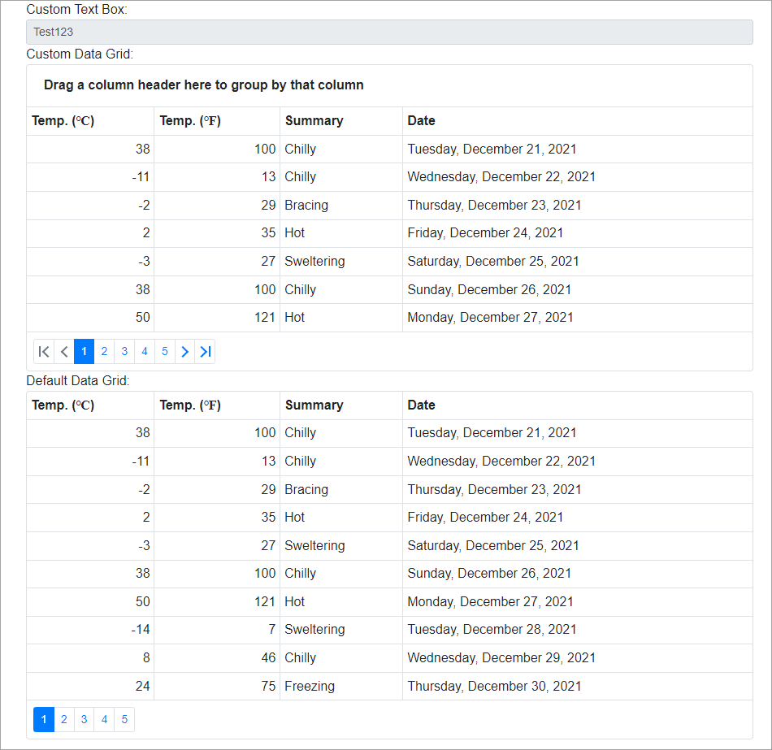

<!-- default badges list -->

<!-- default badges end -->

# DevExpress Blazor Components - Set predefined settings for the specific component

In case of a large web application, controls usually have the same settings on different pages. The recommended Blazor approach is to specify the component settings in the markup. However, you can override the  **SetParametersAsync** method to specify default settings for all DevExpress Blazor components in your application. We do not recommend that you use this approach as it is not natural for Blazor applications.

Create a component that inherits from our Blazor control and overrides the **SetParametersAsync** method. In this method, set the necessary default values for the **public** properties before you call the base method. You can initialize properties with custom default values in the markup because the base method is called after your custom settings. We do not recommend that you override and change values of any protected properties.

In this example, the [MyDataGrid](./CS/DxBlazorComponentsDefaultSettings/Components/MyDataGrid.cs) component contains the inherited **DxDataGrid** component whose **PageSize**, **ShowFilterRow**, and **ShowGroupPanel** properties contain new default values. You can compare the **MyDataGrid** component with the default **DxDataGrid** component on the [Index](./CS/DxBlazorComponentsDefaultSettings/Pages/Index.razor) page: they have the same settings in the markup.

It's not possible to use This approach is not applicable to the **DxChartXXXSeries** components and specify the **ValueField**, **ArgumentField**, **NameField**, and **PaneField** properties.

## Files to Look At

* [Index.razor](./CS/DxBlazorComponentsDefaultSettings/Pages/Index.razor)
* [MyTextBox.cs](./CS/DxBlazorComponentsDefaultSettings/Components/MyTextBox.cs)
* [MyDataGrid.cs](./CS/DxBlazorComponentsDefaultSettings/Components/MyDataGrid.cs)