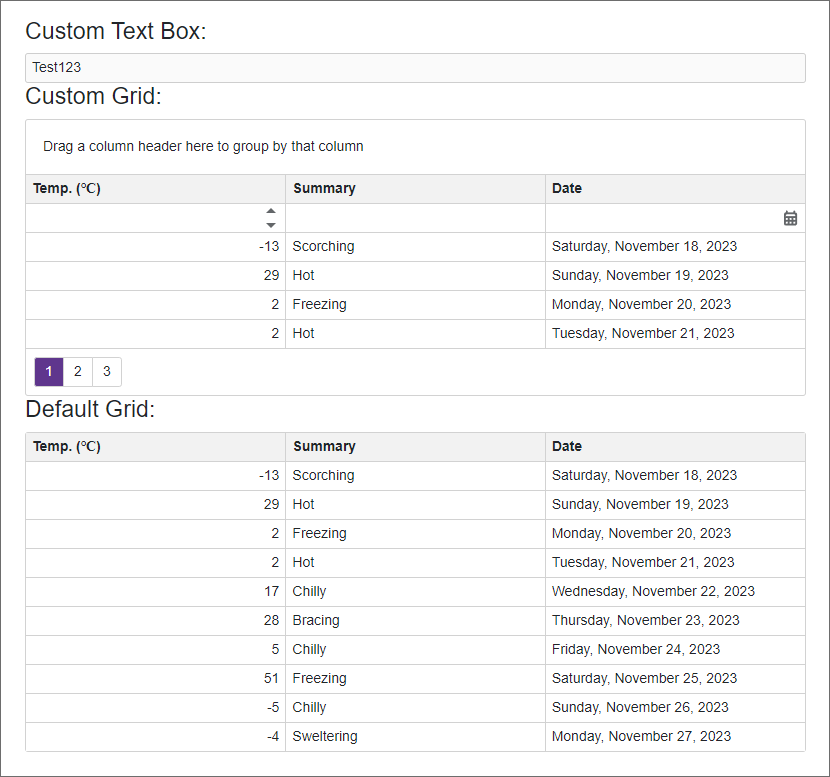

<!-- default badges list -->

<!-- default badges end -->

# DevExpress Blazor Components - Set predefined settings for a specific component

Controls generally have the same settings across different pages within a large web application. We recommend that you specify these component settings in markup. You can also override the **SetParametersAsyncCore** (for the Grid and Editors) or the **SetParametersAsync** (for other components) method to specify default settings for Blazor components used within in your application.

Create an inheritor from our Blazor control to override the **SetParametersAsync** or **SetParametersAsyncCore** method. You can set the default initial values for the **public** properties in either the SetParametersAsync or SetParametersAsyncCore method before you call the base SetParametersXXX method. In markup, you can initialize properties with modified default values since the base method is called after custom settings are applied.

Note: You should not override and change the values of **protected** properties. Such changes may generate unexpected outcomes.

In this example, the [MyGrid](./CS/DxBlazorComponentsDefaultSettings/Components/MyGrid.cs) component contains an inherited **DxGrid** component whose **PageSize**, **ShowFilterRow**, **AllowSort**, and **ShowGroupPanel** properties contain new default values. You can compare the **MyGrid** component to the original **DxGrid** component on the [Index](./CS/DxBlazorComponentsDefaultSettings/Pages/Index.razor) page to ensure they have the same settings in markup.

You cannot use this technique for **DxChartXXXSeries** components and specify the **ValueField**, **ArgumentField**, **NameField**, and **PaneField** properties.

## Files to Review

* [Index.razor](./CS/DxBlazorComponentsDefaultSettings/Pages/Index.razor)
* [MyTextBox.cs](./CS/DxBlazorComponentsDefaultSettings/Components/MyTextBox.cs)
* [MyGrid.cs](./CS/DxBlazorComponentsDefaultSettings/Components/MyGrid.cs)
<!-- feedback -->
## Does this example address your development requirements/objectives?

 

(you will be redirected to DevExpress.com to submit your response)
<!-- feedback end -->
